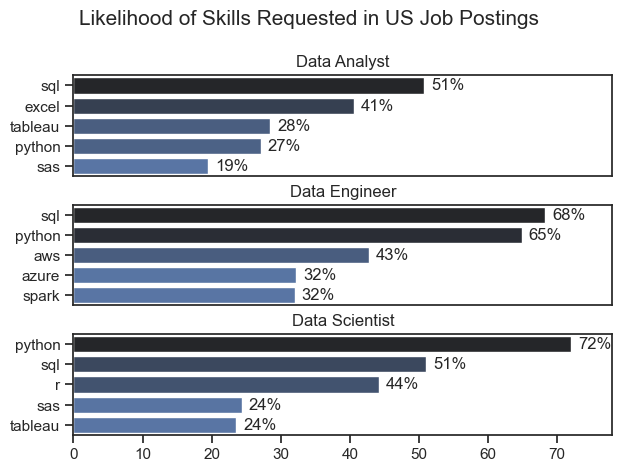
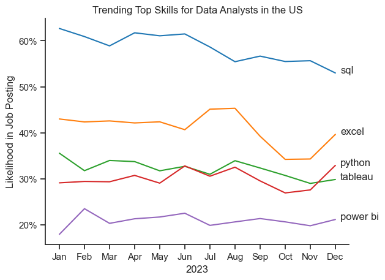

# The Analysis

## 1. What are the most demanded skills for the top 3 most popular data roles?

To find the most demanded skills for the top 3 most popular data roles. I filtered out those positions by which ones were the most popular, and got the top 5 skills for these top 3 roles. This query highlights the most popular job tiltes and thier top skills, showing which skills I should pay attention to depending on the role I am targeting. 

View my notebook with detailed steps here: [2_Skill_Demand.ipynb](3_Project/2_Skills_Demand.ipynb)

### Visualize Data 
```python
fig, ax = plt.subplots(len(job_titles), 1)


for i, job_title in enumerate(job_titles):
    df_plot = df_skills_perc[df_skills_perc['job_title_short'] == job_title].head(5)
    sns.set_theme(style='ticks')
    sns.barplot(data=df_plot, x='skill_percent', y='job_skills', ax=ax[i], hue='skill_count', palette='dark:b_r')
    ax[i].set_ylabel('')
    ax[i].set_xlabel('')
    ax[i].set_title(job_title)
    ax[i].legend().set_visible(False)
    ax[i].set_xlim(0, 78)

    for n, v in enumerate(df_plot['skill_percent']):
        ax[i].text(v + 1, n, f'{v:.0f}%', va='center')
    
    if i != len(job_titles) - 1:
         ax[i].set_xticks([])
         

fig.suptitle('Likelihood of Skills Requested in US Job Postings ', fontsize=15)  
fig.tight_layout(h_pad=0.5)  
plt.show()
```

### Results


### Insights
- Python is aversatile skill, highly demanded across all three roles, but most prominently for Data Scientists (72%) and Data Engineers (65%).
- SQL is the most requested skill for Data Analysts and Data Scientists, with it in over half the job postings for both roles. For Data Engineers, Python is the most sought-after skill, appearing in 68% of job postings.
- Data Engineers require more specialized technical skills (AWZ, Azure, Spark) compared to Data Scientists and Data Analysts who are expected to be proficient in more general data management and analysis tools (Excel, Tableau).


## 2. How are in-demand skills trending for Data Analystst?

### Visualization

```python
sns.lineplot(data=df_plot, dashes=False, palette='tab10')
sns.set_theme(style='ticks')
sns.despine()

from matplotlib.ticker import PercentFormatter
ax = plt.gca()
ax.yaxis.set_major_formatter(PercentFormatter(decimals=0))

for i in range(5):
    plt.text(11.2, df_plot.iloc[-1, i], df_plot.columns[i])

plt.show()
```

### Results

*Bar graph visualizing the trending top skills for data analysts in the US in 2023*

### Insights:
- SQL remains the most consistently demand skill throughout the year, altough it shows a gradual decrease in demand.
- Excel experienced a significant  increase in demand starting around September, surpassing both Python and Tableau by the end of the year.
- Both PYthon and Tableau show relatively stable demand hroughout the year with some fluctuations ut remain essential skills for data analystst. Power BI, while less demanded compared to the others, shows a slight upward trend towards the year's end.


